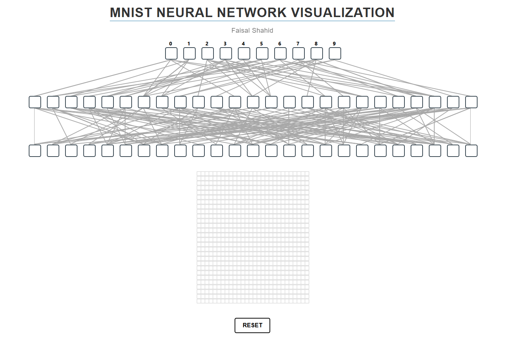

# MNIST Neural Network Visualization

## Project Overview
This project is designed to demystify how an Artificial Neural Network (ANN) processes and classifies handwritten digits from the MNIST dataset. It combines a robust backend for ANN computations with an interactive frontend to visualize the learning process.
---

## Key Components

### 1. MNIST Dataset
- **What it is**:  
  The MNIST dataset consists of 70,000 grayscale images of handwritten digits (0-9), each sized 28x28 pixels. It is a benchmark dataset in machine learning.

---

### 2. Neural Network Architecture
#### 50-Neuron ANN
- **The architecture includes**:
  - **Input Layer**: 784 neurons (28x28 pixels flattened into a vector).
  - **Hidden Layer(s)**: One or more layers with 25 neurons each, enabling the network to learn complex features.
  - **Output Layer**: 10 neurons (one for each digit).
- **Activation Functions**:
  - Likely used Sigmoid for hidden layers and softmax for the output layer.
- **Learning Process**:  
  The ANN learns to classify digits by minimizing the error through backpropagation and optimizing weights using mini batch gradient descent algorithm.

---

### 3. Backend - Flask
- **Purpose**:  
  Handles the computational aspect of the project.
- **Functionality**:
  - Preprocesses the MNIST dataset.
  - Trains the ANN and saves the trained model.
  - Provides API endpoints to:
    - Make predictions on new digit images.
    - Send intermediate results to the front end (e.g., weights, activations).

---

### 4. Frontend - React
- **Purpose**:  
  Creates an interactive user interface.
- **Features**:
  - **Visualization of Learning**: Displays how the ANN processes inputs, updates weights, and identifies features.
  - **Step-by-Step Classification**: Lets users upload or draw digits and see how the ANN classifies them.
  - **Layer Insights**: Visualizes neuron activations and outputs during testing.

---

